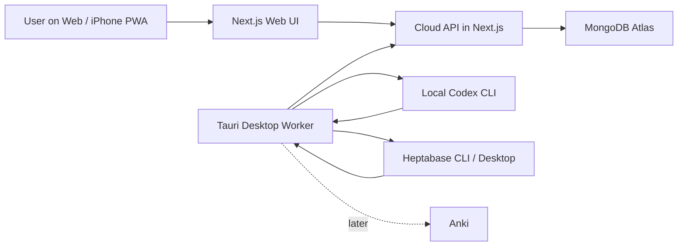

# Architecture

## Status

The Web/API and English recorder are deployed to Vercel. Google authentication, MongoDB Atlas persistence, and the legacy capture-to-Codex-to-Heptabase note path have been production-verified. Journal delivery plus the Workout/Running and Food recorders are implemented and automatically verified in source, but their latest production and cross-device smoke tests remain pending.

## System context



## Component responsibilities

### Web UI

- Provide a mobile-oriented capture form.
- Display captures and processing status.
- Provide a Web App Manifest and Apple metadata so the deployed site can be installed from Safari onto the iPhone Home Screen.
- Register a small first-party service worker after authentication. Static assets are cache-first, the authenticated root shell is network-first with an offline fallback, and API/auth/write requests are never cached.
- Keep pending recorder edits in browser storage and retry them after connectivity returns. Signing out clears the cached authenticated shell.

### Cloud API

- Run inside the Next.js application initially.
- Validate requests and enforce authentication and authorization.
- Own capture persistence and job lifecycle state.
- Provide HTTP endpoints used by both Web and Desktop clients.

For local development, the API runs at `http://localhost:3000` and uses a server-only MongoDB connection configured through environment variables. It exposes:

- `POST /api/captures` to create a pending capture;
- `GET /api/captures/{id}` to read its current state;
- `POST /api/jobs/claim` to atomically move one pending job to processing;
- `PATCH /api/jobs/{id}` to record either a completed result or a retryable failure;
- `POST /api/jobs/retry` to make failed legacy work immediately retryable;
- `GET /api/journal-deliveries` to report pending, processing, and failed Journal work;
- `POST /api/journal-deliveries/claim` to lease the oldest eligible Journal date to the Desktop worker;
- `PATCH /api/journal-deliveries/{attemptId}` to complete or fail one leased batch;
- `POST /api/journal-deliveries` to make failed batches immediately retryable;
- `GET /api/special-records/english?date=YYYY-MM-DD` to read one daily English document;
- `PUT /api/special-records/english` to create, revise, or remove an empty daily English document with optimistic revision checking.
- `GET/PUT /api/special-records/workout` for versioned daily strength/running sessions;
- `GET/PUT /api/special-records/workout/library` for the revision-safe exercise library;
- `GET/PUT /api/special-records/food` for daily food entries and nutrition targets;
- `GET/PUT /api/special-records/food/library` for reusable food defaults.

### MongoDB Atlas

- Persist each capture, its job lifecycle, and its processing result in one `captures` collection.
- Use an index on `status` and `createdAt` to find the oldest pending capture efficiently.
- Atomically claim work by filtering for `pending` and changing it to `processing` in one database operation.
- Enforce the current document contract at the API boundary and in TypeScript. A database-level JSON Schema validator is deferred while the Cloud API remains the only database writer.
- Remain accessible only from trusted server-side code.
- Never expose its connection credentials to the browser or Desktop application.
- Persist versioned English, Workout, and Food payloads in `specialRecords`, uniquely addressed by module and Taipei Journal date. Modules reuse lifecycle fields without sharing domain payload schemas.
- Persist revision-safe exercise and food libraries in `specialRecorderSettings`; library entries use stable IDs so later renames preserve historical relationships.
- Persist Journal delivery state on the source `journalRecords`. One claim leases every eligible idle record for the oldest pending date, preserving oldest-first delivery order without duplicating the raw source data in a second queue.
- Release abandoned 30-minute Journal leases, delay ordinary failures for 15 minutes, and retain the last error for operator visibility.

### Desktop application

- Use Tauri, React, Vite, TypeScript, and Rust.
- Poll the Cloud API rather than accepting inbound connections from the server.
- Run processors that require local machine access.
- Report results and job state changes through the Cloud API.
- Keep the worker alive when its windows are hidden, expose controls through the Windows tray, and prevent duplicate worker instances.
- Open Quick Capture with `Ctrl + Numpad 5` and toggle Worker Status with `Ctrl + NumLock` (`Ctrl + Pause` fallback).
- Optionally register the installed app to start hidden with Windows.
- Discover special Capture pages from `capture-pages/*.page.tsx`. English, Workout, and Food keep immediate local pending caches and reach the Cloud through narrow Tauri commands that reuse the saved Desktop bearer-token configuration.
- Show the authoritative Journal delivery queue in Worker Status and make `Check now` retry failures immediately.

## Special recorder synchronization boundary

- Web and Desktop persist English, Workout, and Food changes locally first, then debounce Cloud writes.
- Cloud writes carry an expected revision so a stale device cannot silently overwrite newer text. The UI preserves a conflicting local pending copy and offers explicit Cloud/local resolution.
- The UI permits editing only the current Taipei date and rolls forward after Taipei midnight. A delayed offline write for an earlier date is accepted only when its recorded client edit timestamp belongs to that same date; this preserves pre-midnight work without opening normal past-date editing.
- Past records are read-only in both clients. Empty English text deletes the current empty daily document, while incomplete Food rows remain local until they have enough data to sync.
- The current slice includes the content-date history list, offline shell, reconnect retry, and explicit conflict resolution. It does not include background-sync API reliance, AI/Anki transformation, or completed cross-device manual verification.

### Processor

- Invoke `codex exec` in ephemeral, read-only mode and provide capture text through standard input rather than a shell argument.
- Write the final Markdown response to a temporary file, then ask the official Heptabase CLI to create a note from that file.
- Require the user-installed Codex CLI to be signed in and Heptabase CLI access to be enabled.
- Run the official Heptabase `start` command before writing, launching Heptabase Desktop when necessary and waiting up to 60 seconds for its local CLI server.
- Return the created Heptabase card ID and title as the Cloud processing result.
- Not own persistence, retry policy, or authoritative job state.
- Report legacy processor failures to Cloud, delay ordinary retry for 15 minutes, expose immediate manual retry, and recover abandoned 30-minute processing leases.
- For Journal batches, deterministically convert the six Capture areas to the approved Markdown bullets and dividers without AI rewriting.
- Read the target Heptabase Journal, then append with its `contentMd5` as a conflict precondition. Cloud records are marked delivered and locked only after the append succeeds.
- A failed Journal append is reported to Cloud and becomes retryable after 15 minutes or immediately through `Check now`.
- The legacy note processor selects `codex-cli` or deterministic `none` through `AiProvider::write_markdown`; an optional Codex model is configuration rather than hard-coded policy.
- Prepared Markdown crosses the `CaptureDestination` port; the current Heptabase CLI implementation can be replaced without changing recorder UI, worker scheduling, or Cloud persistence.

## Desktop polling behavior

The worker checks for work:

1. when it starts while online;
2. when network connectivity returns;
3. every five minutes while running and online;
4. when the user selects a manual check action.

All triggers share one check operation and avoid overlapping polls. The application runs the five-minute schedule in Rust so hiding the WebView window does not stop the worker. One wake drains up to 20 Journal or legacy items, stops on the first error, and reports an aggregate result. Journal and legacy failures have durable retry state. OS suspend pauses the Rust timer naturally; an expired interval and the browser online event resume checking without a Windows-only power-event dependency.

## Trust boundaries

- Browser and Desktop inputs are untrusted and require server-side validation.
- Capture text is passed to Codex through standard input and is never interpolated into a shell command.
- Only the Cloud API may connect to MongoDB Atlas.
- The public deployment must be authenticated before it is treated as usable production.
- The Web uses a stateless Better Auth session created through Google OAuth and authorizes only the configured email address.
- The Desktop uses a separate bearer token. Development reads it from the Rust `.env.local`; an installed build stores a user-entered token in its per-user AppData configuration. Rotating the server token revokes the previous device credential.
- Secrets belong in local or deployment environment configuration, never committed source files.

## Repository direction

The planned monorepo shape is:

```text
apps/
├─ web/       # Next.js Web UI and initial Cloud API
└─ desktop/   # Tauri application and Desktop worker

packages/     # Created only when stable code or contracts are genuinely shared
docs/
```

`packages/recorder-kit` now owns the stable recorder identity, order, label, and symbol contract shared by Web and Desktop. It deliberately does not own recorder implementations or domain payloads. pnpm manages JavaScript and TypeScript workspace dependencies; Cargo manages Rust dependencies inside the Tauri application.
