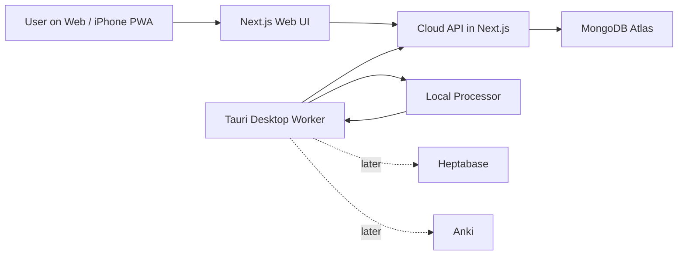

# Architecture

## Status

The Web/API is deployed to Vercel and verified with Google authentication, MongoDB Atlas persistence, and the local Desktop worker. The fake processor remains in place; Codex and destination integrations are planned next.

## System context



## Component responsibilities

### Web UI

- Provide a mobile-oriented capture form.
- Display captures and processing status.
- Provide a Web App Manifest and Apple metadata so the deployed site can be installed from Safari onto the iPhone Home Screen.
- Continue to require a network connection; offline capture and a service worker are not implemented yet.

### Cloud API

- Run inside the Next.js application initially.
- Validate requests and enforce authentication and authorization.
- Own capture persistence and job lifecycle state.
- Provide HTTP endpoints used by both Web and Desktop clients.

For local development, the API runs at `http://localhost:3000` and uses a server-only MongoDB connection configured through environment variables. It exposes:

- `POST /api/captures` to create a pending capture;
- `GET /api/captures/{id}` to read its current state;
- `POST /api/jobs/claim` to atomically move one pending job to processing;
- `PATCH /api/jobs/{id}` to record a completed result.

### MongoDB Atlas

- Persist each capture, its job lifecycle, and its processing result in one `captures` collection.
- Use an index on `status` and `createdAt` to find the oldest pending capture efficiently.
- Atomically claim work by filtering for `pending` and changing it to `processing` in one database operation.
- Enforce the current document contract at the API boundary and in TypeScript. A database-level JSON Schema validator is deferred while the Cloud API remains the only database writer.
- Remain accessible only from trusted server-side code.
- Never expose its connection credentials to the browser or Desktop application.

### Desktop application

- Use Tauri, React, Vite, TypeScript, and Rust.
- Poll the Cloud API rather than accepting inbound connections from the server.
- Run processors that require local machine access.
- Report results and job state changes through the Cloud API.
- Keep the worker alive when its windows are hidden, expose controls through the Windows tray, and prevent duplicate worker instances.
- Open Quick Capture with `Ctrl + Alt + C` and toggle Worker Status with `Ctrl + Alt + W`.
- Optionally register the installed app to start hidden with Windows.

### Processor

- Begin as a deterministic fake processor to verify the job lifecycle.
- Later call the local Codex CLI and return structured output.
- Not own persistence, retry policy, or authoritative job state.

## Desktop polling behavior

The worker checks for work:

1. when it starts while online;
2. when network connectivity returns;
3. every five minutes while running and online;
4. when the user selects a manual check action.

All triggers share one check operation and avoid overlapping polls. The application runs the five-minute schedule in Rust so hiding the WebView window does not stop the worker. Queue draining, durable retries, and explicit sleep-resume handling remain future reliability work.

## Trust boundaries

- Browser and Desktop inputs are untrusted and require server-side validation.
- Only the Cloud API may connect to MongoDB Atlas.
- The public deployment must be authenticated before it is treated as usable production.
- The Web uses a stateless Better Auth session created through Google OAuth and authorizes only the configured email address.
- The Desktop uses a separate bearer token. Development reads it from the Rust `.env.local`; an installed build stores a user-entered token in its per-user AppData configuration. Rotating the server token revokes the previous device credential.
- Secrets belong in local or deployment environment configuration, never committed source files.

## Repository direction

The planned monorepo shape is:

```text
apps/
├─ web/       # Next.js Web UI and initial Cloud API
└─ desktop/   # Tauri application and Desktop worker

packages/     # Created only when stable code or contracts are genuinely shared
docs/
```

pnpm will manage JavaScript and TypeScript workspace dependencies. Cargo will manage Rust dependencies inside the Tauri application. Additional build orchestration will not be introduced until the repository demonstrates a need for it.
