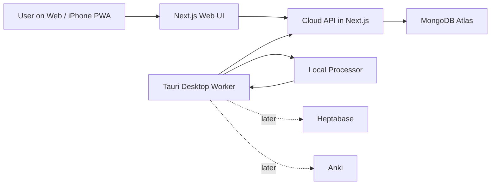

# Architecture

## Status

This document records the initial architecture direction. Components remain planned until their milestone is implemented and verified.

## System context



## Component responsibilities

### Web UI

- Provide a mobile-oriented capture form.
- Display captures and processing status.
- Become installable as an iPhone PWA later.

### Cloud API

- Run inside the Next.js application initially.
- Validate requests and enforce authentication and authorization.
- Own capture persistence and job lifecycle state.
- Provide HTTP endpoints used by both Web and Desktop clients.

### MongoDB Atlas

- Persist captures, jobs, and processing results.
- Remain accessible only from trusted server-side code.
- Never expose its connection credentials to the browser or Desktop application.

### Desktop application

- Use Tauri, React, Vite, TypeScript, and Rust.
- Poll the Cloud API rather than accepting inbound connections from the server.
- Run processors that require local machine access.
- Report results and job state changes through the Cloud API.

### Processor

- Begin as a deterministic fake processor to verify the job lifecycle.
- Later call the local Codex CLI and return structured output.
- Not own persistence, retry policy, or authoritative job state.

## Desktop polling behavior

The worker should check for work:

1. when it starts while online;
2. when network connectivity returns;
3. every five minutes while running and online;
4. when the user selects a manual check action.

All triggers should share one check operation and avoid overlapping polls. Details such as queue draining, tray behavior, and sleep recovery remain undecided until the Desktop worker milestone.

## Trust boundaries

- Browser and Desktop inputs are untrusted and require server-side validation.
- Only the Cloud API may connect to MongoDB Atlas.
- The public deployment must be authenticated before it is treated as usable production.
- The likely direction is a single-user Web login plus a revocable Desktop device token; the specific authentication implementation is not yet selected.
- Secrets belong in local or deployment environment configuration, never committed source files.

## Repository direction

The planned monorepo shape is:

```text
apps/
├─ web/       # Next.js Web UI and initial Cloud API
└─ desktop/   # Tauri application and Desktop worker

packages/     # Created only when stable code or contracts are genuinely shared
docs/
```

pnpm will manage JavaScript and TypeScript workspace dependencies. Cargo will manage Rust dependencies inside the Tauri application. Additional build orchestration will not be introduced until the repository demonstrates a need for it.
